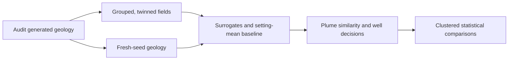

# Groundwater Surrogate Benchmark

[](https://github.com/LocNguyen122/groundwater-surrogate-benchmark/actions/workflows/cpu-checks.yml)
[](LICENSE)
[](requirements-cpu.txt)

Research code for **auditing generalization in groundwater plume surrogates**: conductivity twins,
fresh-seed geology, transport conditioning and engineering decision trade-offs.

**Associated manuscript:** *Auditing Generator-Induced Conductivity Twins in Groundwater Plume Surrogates*.

[Research overview](#research-overview) · [Findings](#research-question-and-methods) ·
[Reproduce summaries](#cpu-only-quick-start) · [Documentation](#documentation) · [Citation](#citation-and-review)

**Status:** review-stage code snapshot, **not a final paper release**. Original research code is MIT-licensed. The associated
manuscript is an unpublished review draft; no article DOI or acceptance is claimed. See [release status](RELEASE_STATUS.json).

## Research overview



Conceptual study design, not empirical plume imagery or an executable simulation pipeline. The audit
distinguishes population-specific predictive accuracy from uncertainty and engineering decision costs.
Raw simulation fields and trained checkpoints are not distributed here.

| Research component | Implementation and evidence |
| --- | --- |
| Predictors and controls | Conductivity-conditioned surrogates, transport-code controls and a conductivity-free setting-mean baseline |
| Generalization audit | Conductivity hashes, empirical random-stream screening and separate evaluation populations |
| Statistical comparisons | Paired stream-clustered inference, hierarchical bootstrap intervals and multiplicity correction |
| Engineering diagnostics | Plume similarity, well exceedances, false alarms and missed exceedances |
| Reproducibility | CPU tests, source checksums, portable summary reproduction and selected/final-checkpoint certifications |

The evaluation populations and averaging weights must be kept explicit. High grouped-split accuracy is not
interchangeable with performance on fresh-seed geology, and average plume similarity is not a well-safety guarantee.

## Research question and methods

Can high accuracy on grouped simulation data establish prediction for new conductivity fields? This study audits
seed reuse and rescaled conductivity twins, compares a conductivity-free setting-mean baseline, and examines
transport-code conditioning under withheld combinations. Implementations include CTA-UNet, the related MS-TMO
variant, CNN/Pix2Pix and operator reference models. Current statistical analysis uses paired random-stream clusters,
hierarchical bootstrap intervals, sign-flip tests and multiplicity correction.

Scientific interpretation matters: original grouped fields have training twins. On independently seeded geology,
matched-code plume SSIM is approximately 0.512, below the setting mean of 0.822. The primary conditioning contrast
remains positive, but the five-seed secondary `(62, 1)` contrast is inconclusive at both selected and final
checkpoints. The related MS-TMO arm is not architecture-independent replication. The bounded log-setting mean
has fewer false alarms but misses more well exceedances than the matched model; it is not Pareto-dominant.
Older results are preserved as historical measurements, not relabeled as evidence of independent-geology
generalization. See the [scientific protocol](docs/SCIENTIFIC_PROTOCOL.md) for the estimands, exclusions and limitations.

## CPU-only quick start

Use Python 3.11 in an isolated environment. CI installs CPU-only PyTorch and does not run training, dataset
generation, GPU evaluation or simulator commands.

On Windows, retained scientific result identifiers can exceed the default checkout path limit. Clone into a
short directory with repository-local long-path support, for example
`git -c core.longpaths=true clone https://github.com/LocNguyen122/groundwater-surrogate-benchmark.git gsb`.
This does not change global Git settings or shorten historical evidence paths. The v8 fresh-clone checks
passed with this mode; an earlier longer-directory checkout failed before tests with `Filename too long`.

```bash
python -m venv .venv
# Activate .venv using the command for your operating system.
python -m pip install torch==2.6.0 --index-url https://download.pytorch.org/whl/cpu
python -m pip install -r requirements-cpu.txt
python scripts/verify_snapshot.py
python scripts/run_release_tests.py
python scripts/validate_release_artifacts.py
python scripts/reproduce_summaries.py --output reproduced
python scripts/review_diagnostics.py --output reproduced/review_diagnostics.json
python scripts/build_review_figures.py --output reproduced/figures
```

`reproduced/` must be new. Summary reproduction verifies the numeric macro bundle and exports checkpoint contrasts
from the shipped statistical summaries. The figure command creates the study schematic, well trade-off plot and
counterfactual matrix from permitted summaries, without restricted field pixels. Numerical sources are not overwritten.
For full 10,000-replicate recomputation from the permitted per-case CSVs:

```bash
python scripts/v7_analysis/regenerate_checkpoint.py --checkpoint best --output reproduced/best.json
python scripts/v7_analysis/regenerate_checkpoint.py --checkpoint last --output reproduced/last.json
```

These longer CPU calculations require neither simulation fields nor checkpoints. Optional engineering output can
differ from a scoring-only summary when the original engineering CSVs are available; the SSIM summaries and
inferential contrasts are unchanged. Absolute means and equal-cluster-weighted contrasts use different weighting.
Macro text is compared with LF-normalized checksums across platforms; certified numerical files retain their
original byte-exact hashes. The first CI run exposed this line-ending portability defect and remains visible in
the packaging record. Earlier incomplete analysis files are historical, not the current macro inputs.

## Layout

- `src/`: paper-specific models, trainers and necessary shared transforms/metrics/evaluation utilities.
- `scripts/`: metric audits, statistics, table/figure utilities and snapshot checks.
- `tests/`: synthetic CPU-safe regression tests; no restricted assets required.
- `configs/`, `splits/`, `metadata/`: training statistics, fixed splits, control mappings and permitted scientific metadata.
- `results/`: lightweight per-case and aggregate measurements, including historical results and current certifications.
- `figures/v7/`: numeric figure provenance only, not simulation arrays or manuscript figures.
- `provenance/`: source file checksums and a record of snapshot-only edits.
- `docs/`: scientific protocol, license status, third-party obligations and contribution guidance.

This compact review package preserves every audited result input and test. Supporting documentation is grouped
in `docs/`; manuscript-only figure sources and unused older figures are not part of the LaTeX package. The large
number of result CSVs is needed for the paired bootstrap analyses, including selected- and final-checkpoint
comparisons. Removing those inputs would prevent reproduction rather than simplify the research.

Historical run identifiers inside result paths are preserved to keep scientific traceability. No development
checkout, compute-cluster workspace or inherited Git history is included.

## Documentation

| Start here | Purpose |
| --- | --- |
| [Reproduction map](docs/REPRODUCIBILITY_MAP.md) | Inputs and commands for manuscript tables and figures |
| [Scientific protocol](docs/SCIENTIFIC_PROTOCOL.md) | Evaluation populations, analysis choices and required disclosures |
| [Training replay](docs/TRAINING_REPLAY.md) | Historical and portable crop modes; limits of exact training replay |
| [Environment provenance](docs/ENVIRONMENT_PROVENANCE.md) | CPU compatibility checks versus the historical training environment |
| [Source lineage](provenance/SOURCE_SNAPSHOT.csv) and [manifest](MANIFEST_CODE_RELEASE.csv) | Auditable source origins and file-level SHA-256 integrity |
| [License scope](docs/LICENSE_STATUS.md) and [third-party notices](docs/THIRD_PARTY_NOTICES.md) | Original-code MIT, exclusions and dependency obligations |

### Verification scope

The 9 October 2026 local checks passed **60 synthetic CPU tests**, exact reproduction of **570 original numeric
macros**, and verification of **250 selected-checkpoint plus 250 final-checkpoint scoring outputs**.
The live badge reports the current GitHub workflow status; it is not a claim of journal acceptance or full
restricted-data reproduction. See the [CPU test record](results/v8/cpu_tests_license_2026-10-09.json) and
[release status](RELEASE_STATUS.json).

## Availability, integrity and limitations

Raw fields, simulation setups/commands/executables, checkpoints and prediction caches are excluded. Full training,
field-based evaluation and inference-dependent figures require separately authorized assets and have **not** been
tested from this repository. Only trusted checkpoint files should ever be loaded. Restricted data access is not
granted by possession of this code. See [scientific protocol and disclosures](docs/SCIENTIFIC_PROTOCOL.md).

The selected- and final-checkpoint scoring campaigns each completed 250 tasks successfully. This closes a scoring
gate, not manuscript approval. Original grouped training suppressed 224 AMP updates; independent retraining
suppressed 70. The older trainer sanitized nonfinite raw outputs, so finite losses do not prove finite raw outputs.
Recovered-artifact and failure disclosures remain in their original scientific summaries.

Original ML/AI code and its original documentation are licensed under [MIT](LICENSE), with the owner's confirmed
authority. This does not license excluded simulation assets or third-party components. Dependencies keep their
own terms; see [license scope](docs/LICENSE_STATUS.md) and
[third-party notices](docs/THIRD_PARTY_NOTICES.md). Material AI assistance in code refactoring, analysis tooling and
language editing is disclosed in the scientific protocol. It does not replace human responsibility for claims.

The GitHub workflow uses read-only permissions and immutable action revisions, following
[GitHub's secure-use guidance](https://docs.github.com/en/actions/reference/security/secure-use). CPU installation
commands follow the [official PyTorch version instructions](https://pytorch.org/get-started/previous-versions/).
Historical training used its recorded environment; CI is a separate compatibility check, not a training rerun.

## Citation and review

Research team: **Loc K. Nguyen**, Allanah Kenny, Theo S. Sarris and Binh P. Nguyen, as recorded in the
source [citation metadata](CITATION.cff). [Loc K. Nguyen's ORCID](https://orcid.org/0000-0003-0561-6659).

Use GitHub's **Cite this repository** entry or [CITATION.cff](CITATION.cff) for software citation, and include
the commit hash used for reproduction. No published-paper citation or article DOI is supplied for the review draft.

`CITATION.cff` identifies this software snapshot without inventing an article DOI or publication. The associated
manuscript is titled *Auditing Generator-Induced Conductivity Twins in Groundwater Plume Surrogates*.
Manuscript approval, confirmed data-access terms and venue fit remain pending; the original-code license is MIT.
See the [table/figure reproduction map](docs/REPRODUCIBILITY_MAP.md),
[crop replay modes](docs/TRAINING_REPLAY.md) and [environment limits](docs/ENVIRONMENT_PROVENANCE.md).
Code-only public distribution is authorized. Public visibility and MIT do not imply a publicly licensed simulation
dataset, complete restricted-asset reproduction, paper submission or journal-policy clearance.
